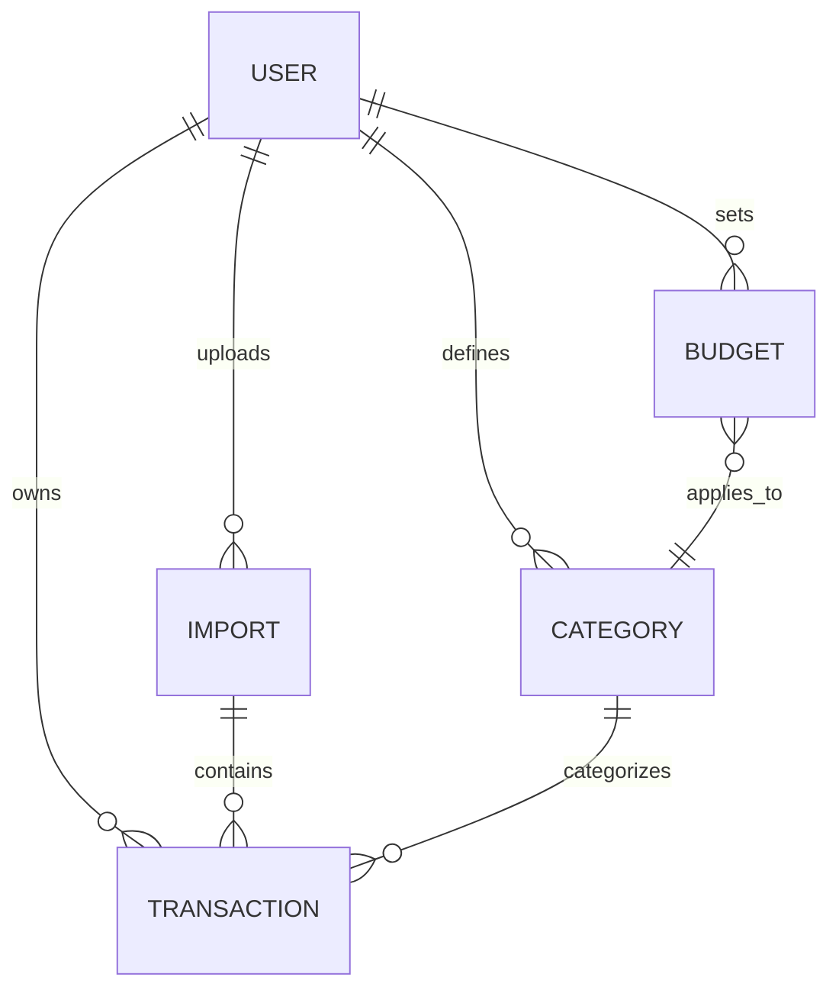

# Domain Model

This document describes the core domain entities for the FinanceTracker API and their relationships. It serves as a guide for database design and API development.

---

## 1. User

Represents an individual using the system.

**Attributes:**

- `id` (UUID) — unique identifier
- `name` (string) — optional, for display
- `email` (string) — optional, for future auth
- `created_at` (datetime) — account creation timestamp

**Notes:**

- Each user has their own transactions, categories, budgets, and import history.
- For V1, assume a single implicit user.

---

## 2. Import

Represents a CSV file uploaded by a user.

**Attributes:**

- `id` (UUID) — unique identifier
- `user_id` (UUID) — owner
- `file_name` (string) — original CSV file name
- `upload_date` (datetime)
- `row_count` (integer) — total rows in CSV
- `processed_count` (integer) — number of transactions successfully imported
- `duplicate_count` (integer) — number of duplicates detected
- `status` (enum: pending, processing, completed, failed)
- `column_mapping` (JSON) — maps CSV columns to internal fields

**Relationships:**

- One-to-many with `Transaction`
- Belongs to one `User`

---

## 3. Transaction

Represents a single financial event (income or expense).

**Attributes:**

- `id` (UUID)
- `user_id` (UUID) — owner
- `import_id` (UUID) — source import
- `date` (date or timestamp)
- `amount` (decimal) — positive for income, negative for expense
- `raw_description` (string) — as received from CSV
- `normalized_description` (string) — cleaned/standardized description
- `balance` (decimal) — optional, from CSV if available
- `category_id` (UUID) — assigned category
- `created_at` (datetime)
- `deduplication_hash` (string) — optional hash of key fields

**Relationships:**

- Belongs to one `User`
- Belongs to one `Import`
- Optional: belongs to one `Category`

**Notes:**

- Transactions are **immutable** (date, amount, description do not change after import)
- Deduplication is performed using a hash or composite unique constraint on `user_id + date + amount + normalized_description`

---

## 4. Category

Represents a classification for transactions.

**Attributes:**

- `id` (UUID)
- `user_id` (UUID) — owner
- `name` (string)
- `description` (string) — optional
- `created_at` (datetime)

**Relationships:**

- One-to-many with `Transaction`

**Notes:**

- Categories help with budgets and reporting.
- Users can create or customize categories.

---

## 5. Budget

Represents a spending limit over a period for a specific category.

**Attributes:**

- `id` (UUID)
- `user_id` (UUID)
- `category_id` (UUID)
- `period` (enum: weekly, monthly, yearly)
- `limit_amount` (decimal)
- `created_at` (datetime)

**Relationships:**

- Belongs to one `User`
- References one `Category`

**Notes:**

- Budgets are used for generating alerts when spending approaches or exceeds limits.

---

## 6. Relationships Diagram (Optional)

Here is a Mermaid diagram showing relationships:

---

## 7. Notes on Immutability and Deduplication

- Transactions imported from CSV **should not be edited** after creation (except category assignment).
- Deduplication can be performed using either:
  - A `deduplication_hash` column (SHA256 of `user_id + date + amount + normalized_description`)  
  - Or a **composite unique constraint** in the database on `(user_id, date, amount, normalized_description)`
- Raw CSV data is preserved to allow reprocessing, debugging, or improving normalization logic.

---

## 8. Optional Future Entities

- `Tag` — for user-defined labels on transactions
- `Merchant` — to normalize merchants across different CSV descriptions
- `Account` — for multiple bank accounts or credit cards per user
- `Currency` — for multi-currency support
- `Alert` — for overspending or unusual activity

---

**End of Domain Model**